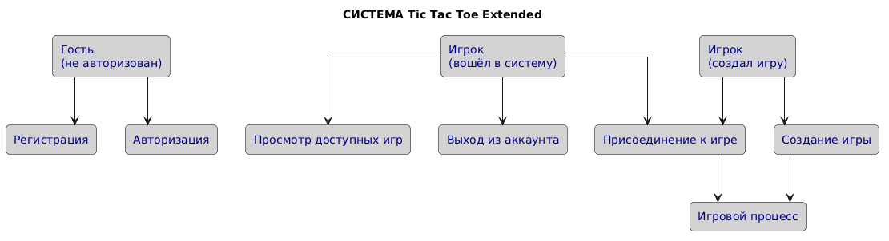

# Отчет о учебной практике УП.02

## Задание 1. Описание тематики дипломного проекта

### Актуальность темы

В современном мире онлайх игры становятся всё более популярными, сочетая в себе развлекательность и социальную составляющую. Классическое приложение "Крестики-нолики" остаётся простым и доступным, но имеет ограниченный функционал. Расширенная версия с 7x7 полем, препятствиями и системой очков делает игру более стратегической и увлекательной, что отвечает современным требованиям к онлайн-развлечениям.

### Целевая аудитория

- **Основные пользователи**: Люди в возрасте 12-45 лет, интересующиеся настольными играми и головоломками
- **Дополнительные пользователи**: Студенты и школьники для совместного времяпрепровождения во время перерывов

### Предполагаемые функциональные возможности

- Игровое поле 7x7 с случайно размещёнными препятствиями
- Система подсчта очков за комбинации из 3 и более символов в ряд
- Регистрация и авторизация игроков
- Создание и поиск доступных игр
- Игра по сети в реальном времени
- История завершённых игр (будущая функция)
- Игра с компьютерным противником (будущая функция)
- и многие другие (полный список будущих функций можно посмотреть на страничке http://localhost:5173/roadmap)

### Используемые технологии (предварительно)

- **Frontend**: React, Vite, Axios, React Router
- **Backend**: Node.js, Express, Sequelize
- **База данных**: SQLite
- **Стилизация**: CSS3, Flexbox/Grid
- **Авторизация**: JWT токены

### Ожидаемый результат

Рабочее веб-приложение, позволяющее двум игрокам играть в крестики-нолики онлайн с расширенными правилами, сохранением истории игр и возможностью просматривать статистику.

## Задание 2. Use-case диаграмма

## Задание 3. Проектирование и начальная разработка интерфейса

### Структура сайта

1. **Страница входа** (`/login`) — форма авторизации
2. **Страница регистрации** (`/register`) — форма создания аккаунта
3. **Главная страница** (`/`) — лобби с доступными играми и формой создания
4. **Страница игры** (`/games/:id`) — игровое поле и управление
5. **Страница профиля** (`/profile`) — информация об игроке

### Скриншоты приложения

Демонстрация: создание игры, присоединение к ней и игровой процесс.

### Ссылки

- Развернутое приложение: http://localhost:5173 (локальный запуск)
- Репозиторий: текущий репозиторий
- Подробные инструкции по запуску в [README.md](README.md)