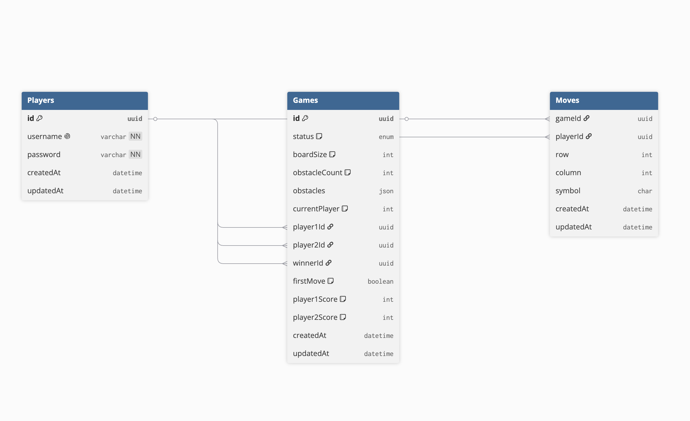

# Отчет о учебной практике УП.11

## Задание 1. Проектирование базы данных

### Определение таблиц

База данных состоит из 3 основных таблиц:

1. **Players** — игроки
2. **Games** — игровые сессии
3. **Moves** — ходы в играх

### Структура таблиц и поля

#### Таблица Players
| Поле | Тип | Описание | PK/FK |
|------|-----|----------|-------|
| id | UUID | Уникальный идентификатор игрока | PK |
| username | STRING | Имя пользователя (уникально) | — |
| password | STRING | Хеш пароля | — |
| createdAt | DATETIME | Дата создания | — |
| updatedAt | DATETIME | Дата обновления | — |

#### Таблица Games
| Поле | Тип | Описание | PK/FK |
|------|-----|----------|-------|
| id | UUID | Уникальный идентификатор игры | PK |
| status | ENUM | Статус: waiting/active/finished | — |
| boardSize | INTEGER | Размер поля | — |
| obstacleCount | INTEGER | Количество препятствий | — |
| obstacles | JSON | Массив позиций препятствий | — |
| currentPlayer | INTEGER | Текущий игрок (1 или 2) | — |
| firstMove | BOOLEAN | Флаг первого хода | — |
| player1Id | UUID | ID первого игрока | FK → Players |
| player2Id | UUID | ID второго игрока | FK → Players |
| winnerId | UUID | ID победителя | FK → Players |
| player1Score | INTEGER | Счёт первого игрока | — |
| player2Score | INTEGER | Счёт второго игрока | — |
| createdAt | DATETIME | Дата создания | — |
| updatedAt | DATETIME | Дата обновления | — |

#### Таблица Moves
| Поле | Тип | Описание | PK/FK |
|------|-----|----------|-------|
| id | INTEGER (AI) | Уникальный идентификатор хода | PK |
| gameId | UUID | ID игры | FK → Games |
| playerId | UUID | ID игрока | FK → Players |
| row | INTEGER | Строка хода | — |
| column | INTEGER | Колонка хода | — |
| symbol | CHAR(1) | Символ (X или O) | — |
| createdAt | DATETIME | Дата создания | — |
| updatedAt | DATETIME | Дата обновления | — |

### Связи между таблицами

- **Players 1 → M Games**: один игрок может создать несколько игр (player1Id)
- **Players 1 → M Games**: один игрок может присоединиться к нескольким играм (player2Id)
- **Players 1 → M Moves**: один игрок может сделать много ходов
- **Games 1 → M Moves**: одна игра содержит много ходов

## Задание 2. Реализация базы данных в СУБД

База данных реализована в SQLite через Sequelize ORM. Схема автоматически создается при запуске сервера (`sequelize.sync({ alter: true })`).

Файлы моделей находятся в `/server/models/`:
- `player.js` — модель игрока
- `game.js` — модель игры
- `move.js` — модель хода

## Задание 3. SQL-запросы

```sql
-- 1. SELECT с условием (игры в статусе waiting)
SELECT id, status, boardSize, obstacleCount, player1Id 
FROM Games 
WHERE status = 'waiting';

-- 2. INSERT (создание игрока)
INSERT INTO Players (id, username, password, createdAt, updatedAt) 
VALUES (NULL, 'newPlayer', '$2hashedPassword', CURRENT_TIMESTAMP, CURRENT_TIMESTAMP);

-- 3. UPDATE (обновление счёта)
UPDATE Games 
SET player1Score = 5, player2Score = 3, status = 'finished', winnerId = 'player-uuid' 
WHERE id = 'game-uuid';

-- 4. DELETE (удаление игры)
DELETE FROM Games WHERE id = 'game-uuid';

-- 5. SELECT с JOIN (получение игр с именами игроков)
SELECT g.id, g.status, p1.username as player1Name, p2.username as player2Name
FROM Games g
LEFT JOIN Players p1 ON g.player1Id = p1.id
LEFT JOIN Players p2 ON g.player2Id = p2.id
WHERE g.status = 'active';
```

## Задание 4. Отчётность и оформление

### ER-диаграмма



### Структура репозитория

- `/server/models/` — файлы моделей Sequelize
- `/server/config/database.js` — конфигурация БД
- `/server/server.js` — основной сервер с миграциями
- `/server/database.sqlite` — файл базы SQLite

### Ссылки

- Подробные инструкции в [README.md](README.md)